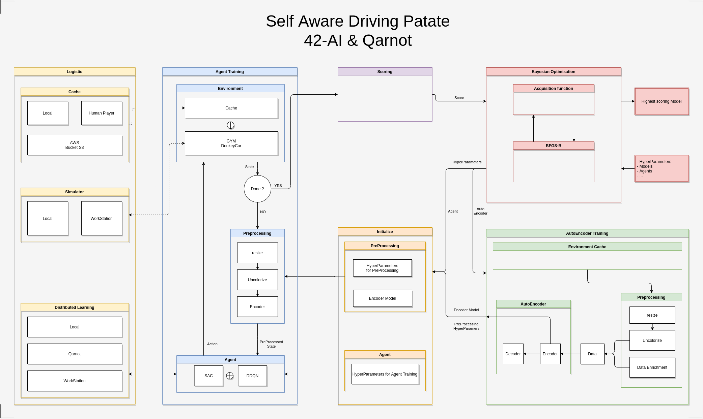

# Self-Aware-Driving-Patate

A project by @dberger @jbarment @ldevelle @llenotre @gilles595

A big thank to [Qarnot](https://qarnot.com/) who supports us through this endeaviour by offering us cloud computing.
If you would like to see how we interact with their platforn to launch our calculations, [Here's our wrapper repository](https://github.com/ezalos/Qarnot_Wrapper)

# Usage:

From base directory (or model save and load is broken):
```sh
python3 Archi/train_simulator.py --sim ../../DonkeyCar/DonkeySimLinux/donkey_sim.x86_64 --model 'new_model.h5'
```

# Architecture



1. Input data
   - Interaction with simulator
   - From datasets
  
2. Preprocessing
	- From raw data
  
3. Model training
	- reward optimisation
	- all hyper_parameters given in `init()`
	- followup of metrics (loss / accuracy)
  
4. Model evaluation
	- Saving the model, with HyperParams
	- Evaluate the model

$$ f(x, \mu, \sigma) = \frac{1}{\sigma\sqrt{2\pi}}e ^\frac{-(x -\mu) ^ 2}{2\sigma ^ 2} $$

# Utils

- Multiprocessing -> Takes complete architecture in hand
- Qarnot computing -> HyperParams optim : https://github.com/ezalos/Qarnot_Wrapper
- Distance control of WS : https://github.com/ezalos/emails
  

# SimLauncher3000
Source the .env file, import Client, Server and start_server from the package.   
use
```python
c = Client()
c.request_simulator()
c.kill_sim()
```

# How to use with SimLauncher3000

## In docker

Where we train the agent:

```sh
export PS="wesh" ; python3.8 srcs --sim simlaunch3000 --model 'new_model.h5' --agent DDQN
```

## In computer

Where we run the simulator:

```sh
cd srcs/simlaunch3000
export PS="wesh" ; export SIM_PATH="/Users/deyaberger/projects/DonkeySimMac/donkey_sim.app/Contents/MacOS/donkey_sim" ; python3.8 test_server.py
```

# Data
Two elements can be saved locally or on S3:</br>
To save and load everything from S3, please activate this variable in config:
```
config_Datasets.S3_connection = True
```
</br>

## 1 - Model Weights:
</br>

### 1a) Loading a model:
function "_load_model" in Agent class.
```
config_Datasets.load_model = True
config_Datasets.model_to_load = <the_model_name>
```
<the_model_name> is just the file name, in S3 or locally.
The complete path depends on:</br> ```config_Datasets.local_model_folder``` if it is local</br>
```config_S3.model_folder``` if it is with S3
Once those 2 folders names are correct, you won't have to change them all the time</br></br>

### 1b) Saving a model:
function "save_modelo" in Agent class.
Please change accordingly the following config variable:</br>
```
config_Datasets.saving_frequency
```
(equals to 0 if you want to turn off the saving)</br>
you won't need to change anything in config, just make sure that the following variables suits you:</br>
```config_Datasets.model_to_save_name```
```config_Datasets.local_model_folder```
```config_S3.model_folder``` </br></br>

## 2) Simulator Cache:
It is all the infos that are returned by the function "simulator.env.step(action)", aka: ```state, action, new_state, reward, done, infos```</br></br>
### 2a) Saving datapoints:
Function "add_simcache_point" in Agent class
You can change the following variable to your conveniance:
```
config_Datasets.size_SimCache = 300
```
300 is the number of datapoints contained in one simcache file. The higher the number, the heavier the file.</br>
Make sure the path variables are correct so that it saves in the right path:
```config_Datasets.sim_infos_name```
```config_Datasets.local_sim_folder``` for local saving
```config_S3.simulator_folder``` for S3 saving</br></br>
### 2b) Loading datapoints:
If you want to use simcache in your training instead of the simulator itself, please look at the function "train_agent_from_SimCache" in NeuralPlayer</br>
You can either pick on file or an entire folder (S3 or locally)
If it is just one file, then do the following:</br>
```
config_Datasets.sim_from_folder = False
config_Datasets.sim_to_load = <your_file_name>
```
If you want to pick all files from one folder:</br>
```
config_Datasets.sim_from_folder = True
config_Datasets.local_sim_folder = <your_folder>
```
or with S3:
```
config_Datasets.sim_from_folder = True
config_S3.simulator_folder = <S3_folder>
```


